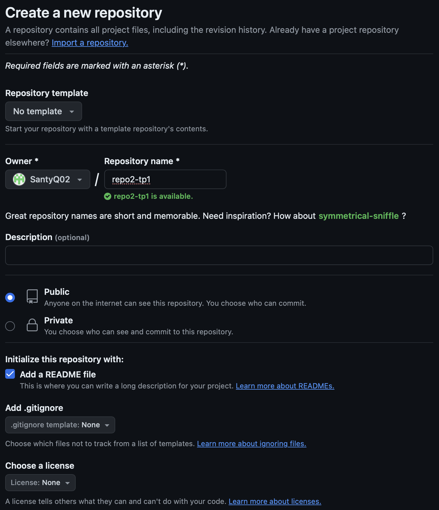
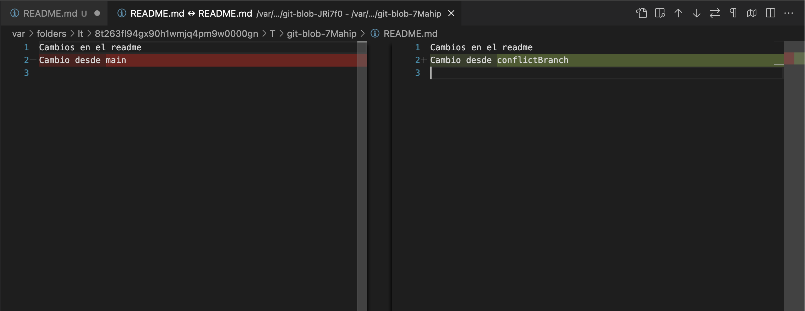

# Trabajp Práctico 1 - Git Básico

### 1- Instalar Git
Como ya tengo git instalado:

### 2- Crear un repositorio local y agregar archivos

### 3- Configuración del Editor Predeterminado

### 4- Creación de Repos 01 -> Crearlo en GitHub, clonarlo localmente y subir cambios
Como ya poseo una cuenta de GitHub:

### 5- Creación de Repos 02 -> Crearlo localmente y subirlo a GitHub

### 6- Ramas

### 7- Merges

### 8- Resolución de Conflictos
En este caso voy a utilizar VScode como herramienta de comparación:

### 9- Familiarizarse con el concepto de Pull Request

Pull Request: solicitud para que los cambios en una rama sean revisados y aceptados en otra rama del proyecto.

### 10- Algunos ejercicios online

