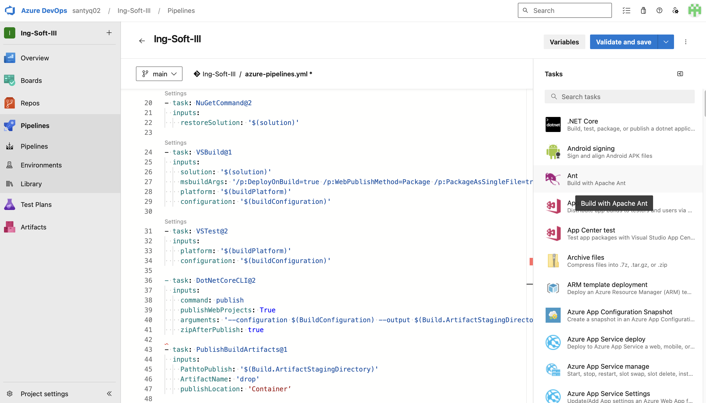
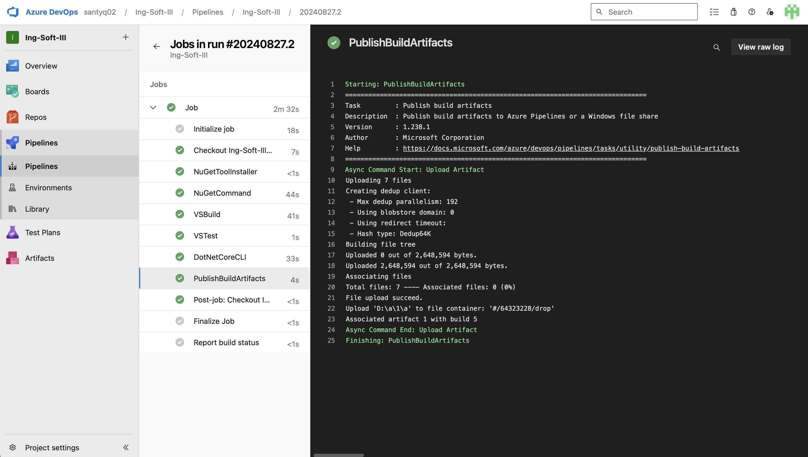
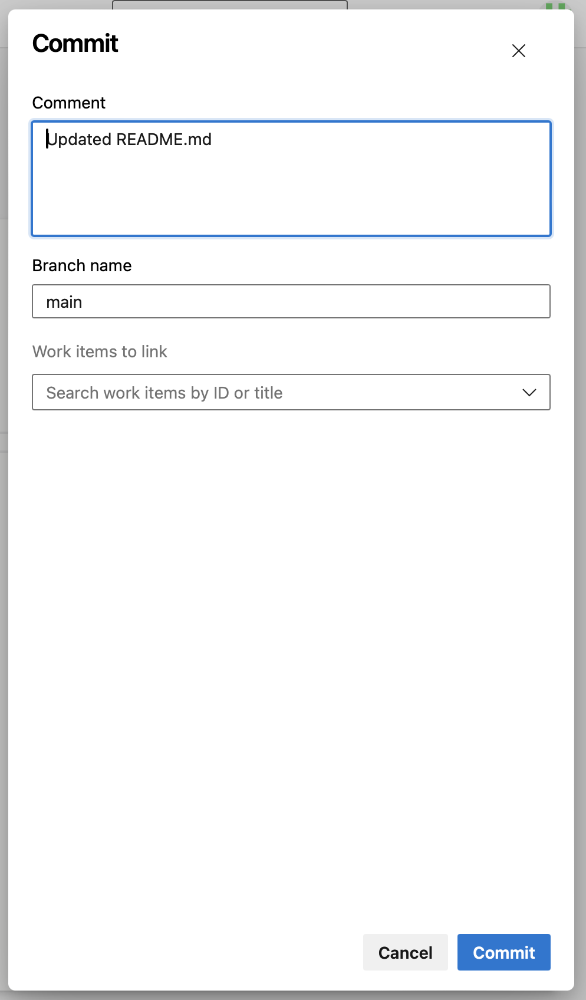
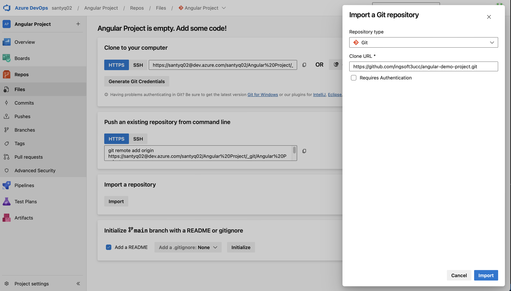

# Trabajp Práctico 4 - Azure Devops Pipelines

### 4- Pasos del TP

#### 4.1 Verificar acceso a Pipelines concedido

Como no poseo acceso público a Pipelines, voy a configurar el proyecto como privado:

#### 4.2 Agregar en pipeline YAML una tarea de Publish

#### 4.3 Explicar por qué es necesario contar con una tarea de Publish en un pipeline que corre en un agente de Microsoft en la nube

La tarea de Publish es necesaria en un pipeline que corre en un agente de Microsoft en la nube para guardar y compartir los artifacts generados, ya que los agentes en la nube no mantienen datos entre ejecuciones. Sin esta tarea, los artifacts se perderían al terminar el pipeline.

#### 4.4 Descargar el resultado del pipeline y correr localmente el software compilado.

Corremos el pipeline:

Y descargamos el drop del pipeline:

#### 4.5 Habilitar el editor clásico de pipelines. Explicar las diferencias claves entre este tipo de editor y el editor YAML.

Una de las diferencias claves es que el editor clasico de pipelines está orientadoa usuarios menos experimientados mientras que el editor YAML es para usuarios más técnicos y posee ventajas claves como el versionado.

#### 4.6 Crear un nuevo pipeline con el editor clásico. Descargar el resultado del pipeline y correr localmente el software compilado.

#### 4.7 Configurar CI en ambos pipelines (YAML y Classic Editor). Mostrar resultados de la ejecución automática de ambos pipelines al hacer un commit en la rama main.

#### 4.8 Explicar la diferencia entre un agente MS y un agente Self-Hosted. Qué ventajas y desventajas hay entre ambos? Cuándo es conveniente y/o necesario usar un Self-Hosted Agent?

Un agente Microsoft-hosted es gestionado por Microsoft, ofrece fácil configuración y actualización automática, ideal para flujos de trabajo simples, pero con limitaciones en tiempo de ejecución y recursos. En contraste, un agente Self-hosted es gestionado por el usuario, ofreciendo mayor control, flexibilidad y sin restricciones de recursos, pero requiere más esfuerzo para mantener y es ideal cuando se necesitan entornos específicos o integración con infraestructura interna. Usar un agente Self-hosted es conveniente cuando se necesitan configuraciones personalizadas, mayor control sobre el entorno, o se busca evitar las limitaciones de los agentes en la nube.

#### 4.8 Crear un Pool de Agentes y un Agente Self-Hosted

#### 4.9 Instalar y correr un agente en nuestra máquina local.

#### 4.10 Crear un pipeline que use el agente Self-Hosted alojado en nuestra máquina local.

#### 4.11 Buscar el resultado del pipeline y correr localmente el software compilado.

#### 4.12 Crear un nuevo proyecto en ADO clonado desde un repo que contenga una aplicación en Angular como por ejemplo https://github.com/ingsoft3ucc/angular-demo-project.git

#### 4.13 Configurar un pipeline de build para un proyecto de tipo Angular como el clonado.

Modificamos el .yaml para que haga las task de publish:

Vemos que se ejecuto correctamente:

#### 4.14 Habilitar CI para el pipeline.

Viene habilitado por defecto en pipelines .yaml:

#### 4.15 Hacer un cambio a un archivo del proyecto (algún cambio en el HTML que se renderiza por ejemplo) y verificar que se ejecute automáticamente el pipeline.

Vemos que se ejecuto correctamente:

#### 4.16 Descargar el resultado del pipeline y correr en un servidor web local el sitio construido.

#### 4.17 Mostrar el antes y el después del cambio.

