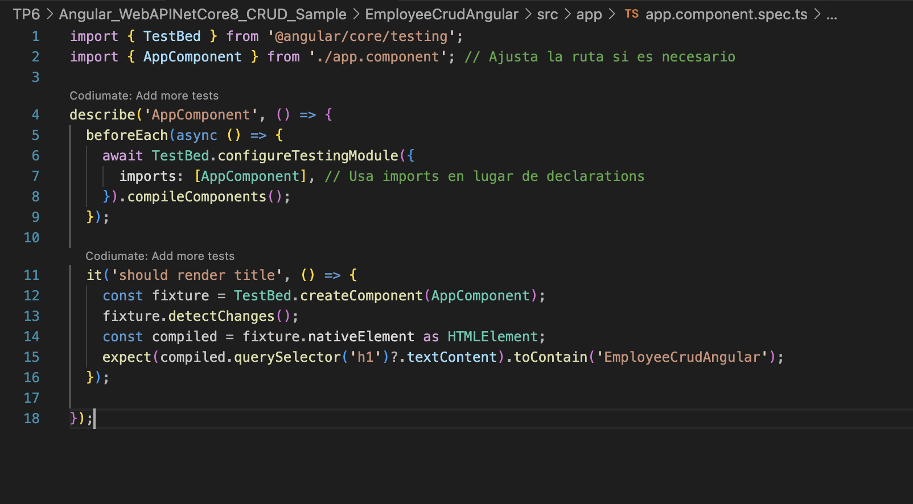
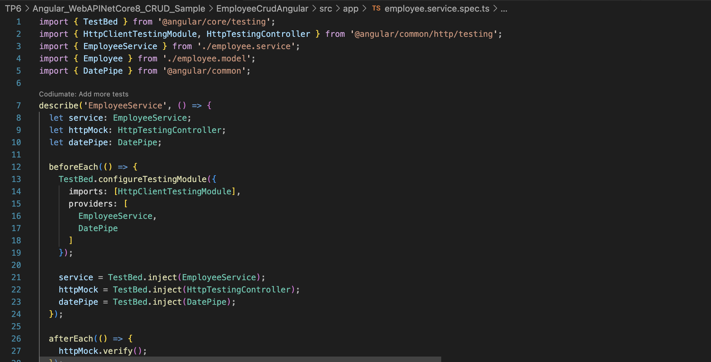
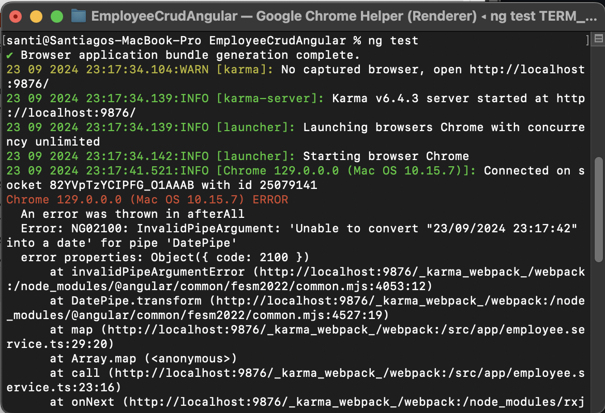
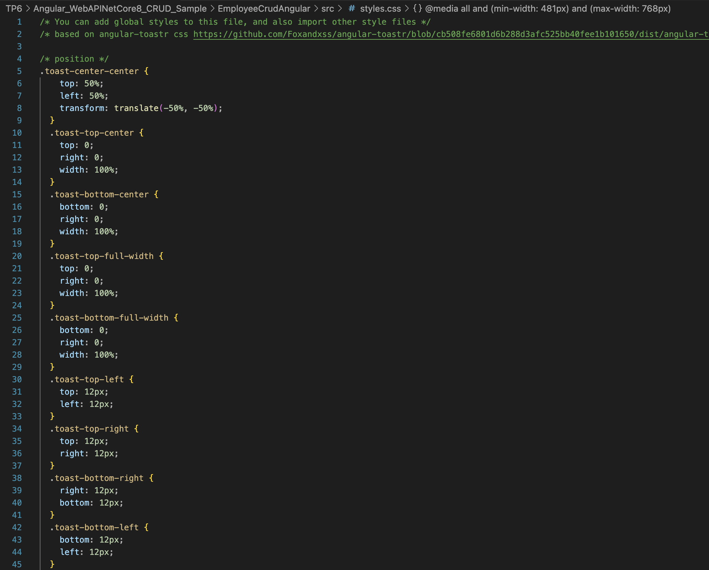

# Trabajo Práctico 6 - Pruebas Unitarias

### 4- Desarrollo

#### 4.1 Creación de una BD SQL Server para nuestra App

Montamos una imagen Docker de SQL Server:

Para este punto utilicé la imagen que provee Azure ya que la de sql server no funciona en procesadores con arquitectura ARM64:

Sqlcmd tool tampoco está disponible para arquitecturas ARM64, por lo que directamente conecté la instancia de sql server con DBeaver dondé ejecuté las consultas:

Ejecutamos el siguiente script:

#### 4.2 Obtener nuestra App

Clonamos el repositorio:

Modificamos el appsettings.json:

Ejecutamos el comando dotnet run --urls "http://localhost:7150":

Navegamos a http://localhost:4200 y verificamos el correcto funcionamiento de nuestro front-end Angular

#### 4.3 Crear Pruebas Unitarias para nuestra API

Creamos un nuevo proyecto de pruebas unitarias para nuestra API en el directorio raiz de nuestro repo:

Instalamos las dependencias:

Editamos el archivo UnitTest1.cs:

Renombramos el archivo:

Agregamos una referencia a nuestro proyecto de EmployeeCrudApi:

Ejecutamos y verificamos que se hayan ejecutado correctamente las pruebas:

Modificamos la cadena de conexión en el archivo appsettings.json para que use un usuario o password incorrecto y recompilar el proyecto EmployeeCrudApi:

Verificamos que nuestro proyecto ya no tiene acceso a la BD navegando a http://localhost:7150/swagger/index.html y probando uno de los controladores:

Volvemos a correr las pruebas y verificmos que se hayan ejecutado correctamente las pruebas inclusive sin tener acceso a la BD, lo que confirma que es efectivamente un conjunto de pruebas unitarias que no requieren de una dependencia externa para funcionar:

Volvemos a modificar la cadena de conexión en el archivo appsettings.json para que use el usuario y password correcto y recompilar el proyecto EmployeeCrudApi:

#### 4.4 Creamos pruebas unitarias para nuestro front de Angular

Nos posicionamos en nuestro proyecto de front, en el directorio EmployeeCrudAngular/src/app:

Editamos el archivo app.component.spec.ts

Creamos el archivo employee.service.spec.ts:

Editamos el archivo employee.component.spec.ts ubicado en la carpeta employee:

Editamos el archivo addemployee.component.spec.ts ubicado en la carpeta addemployee:

En el directorio raiz de nuestro proyecto EmployeeCrudAngular ejecutamos el comando ng test y vemos que los tests se ejecutaron correctamente::

Corregimos employee.service.spec.ts y volvemos a ejecutar los tests:

Verificamos que no esté corriendo nuestra API navegando a http://localhost:7150/swagger/index.html y recibiendo esta salida:

#### 4.5 Agregamos generación de reporte XML de nuestras pruebas de front

 Instalamos dependencia karma-junit-reporter:

 

 En el directorio raiz de nuestro proyecto (al mismo nivel que el archivo angular.json) creamos un archivo karma.conf.js con el siguiente contenido:

 

 Ejecutamos nuestros test:

 

 Verificamos que se creo un archivo test-result.xml en el directorio test-results que está al mismo nivel que el directorio src

 

 #### 4.6 Modificamos el código de nuestra API y creamos nuevas pruebas unitarias

 Voy a realizar las siguientes 5 modificaciones sugeridas al código de la API:

 * La longitud máxima del nombre y apellido del empleado debe ser de 100 caracteres.
 * Validar que el nombre tenga un número mínimo de caracteres, por ejemplo, al menos dos caracteres para evitar entradas inválidas como "A".
 * Verificar que el nombre no contenga números, ya que no es común en los nombres de empleados.
 * Asegurar que cada parte del nombre (separada por espacios) tenga al menos un carácter o más, por ejemplo, para evitar "A B".
 * Verificar que no haya palabras vacías o que el nombre no esté compuesto solo de espacios.

 

 Creamos las pruebas unitarias necesarias para validar las modificaciones realizadas en el código:

 

 Hacemos build a los test y los corremos:

 

#### 4.7 Modificamos el código de nuestro Front y creamos nuevas pruebas unitarias

Realizamos en el código del front las mismas modificaciones hechas a la API:

Agregamos las importaciones necesarias para ToastrModule y BrowserAnimationsModule en app.config.ts:

Importamos el css con los estilos de toast:

Agregamos las validaciones en AddEmployee y las probamos:

Creamos las pruebas unitarias necesarias en el front para validar las modificaciones realizadas en el código del front:

Vemos que se ejecuten correctamente:

### 6- DesarrolloPresentación del trabajo práctico

El proyeto se encuentra en la misma carpeta TP6 y en el siguiente repositorio de GitHub:

https://github.com/SantyQ02/Angular_WebAPINetCore8_CRUD_Sample.git