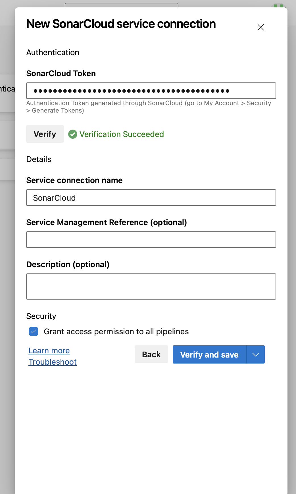
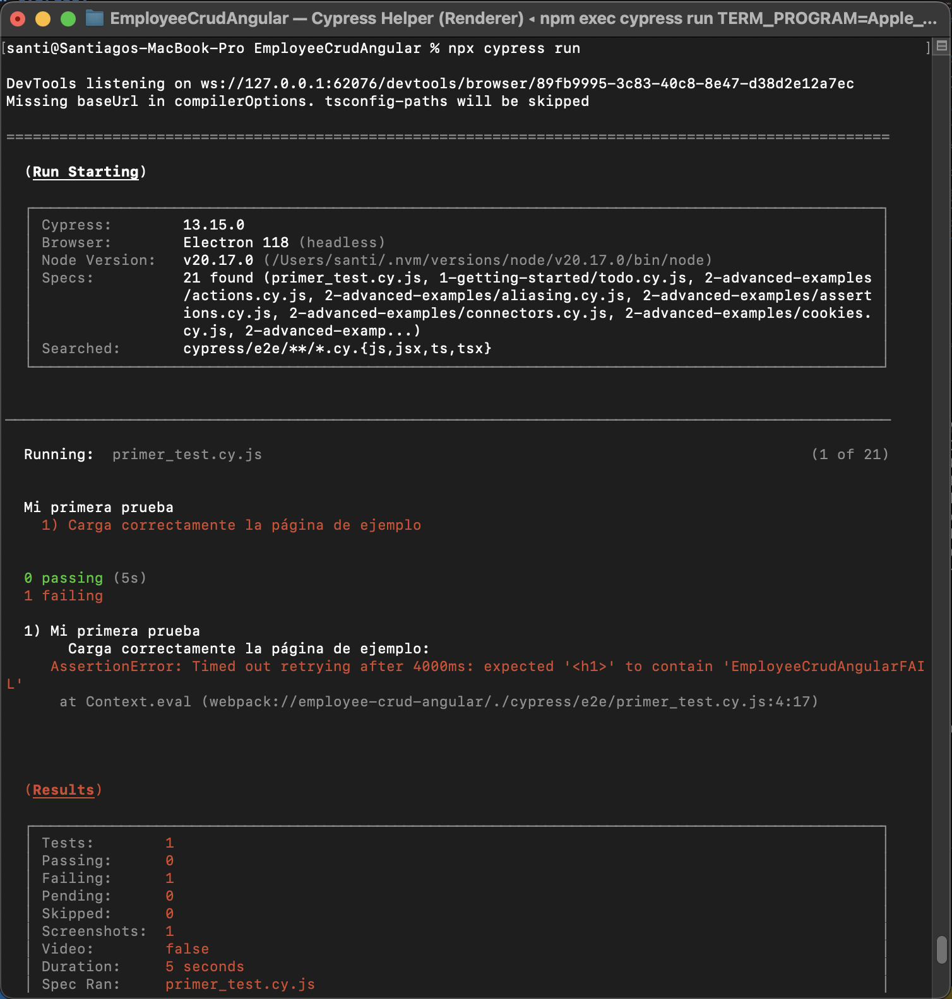

## Trabajo Práctico 7 - Code Coverage, Análisis estático de Código y Pruebas de Integración

### Desarrollo:

#### 4.1 Agregar Code Coverage a nuestras pruebas unitarias de backend y front-end e integrarlas junto con sus resultados en nuestro pipeline de build.

##### 4.1.1 En el directorio raiz de nuestro proyecto Angular instalar el siguiente paquete:

##### 4.1.2 Editar nuestro archivo karma.conf.js para que incluya reporte de cobertura

##### 4.1.3 En el dir raiz del proyecto EmployeeCrudApi.Tests ejecutar:

#### 4.1.4 Agregar a nuestro pipeline ANTES del Build de Back la tarea de test con los argumentos especificados y la de publicación de resultados de cobertura:

##### 4.1.5 Agregar a nuestro pipeline ANTES del Build de front la tarea de test y la de publicación de los resultados.

##### 4.1.6 Ejecutar el pipeline y analizar el resultado de las pruebas unitarias y la cobertura de código.

#### 4.2 Agregar Análisis Estático de Código con SonarCloud:

Realizamos la conexión con SonarCloud:

##### 4.2.1 Integraremos SonarCloud para analizar el código fuente. Configurar SonarCloud en nuestro pipeline siguiendo instructivo 5.1

- Antes de nuestra tarea de Build del Back:

- Despues de nuestra tarea de Build del Back:

##### 4.2.2 Vemos el resultado de nuestro pipeline, en extensions tenemos un link al análisis realizado por SonarCloud

##### 4.2.3 Ir al link y analizar toda la información obtenida. Detallar en la entrega del TP los puntos más relevantes del informe, qué significan y para qué sirven.

##### Análisis de SonarCloud

La sección de Severity divide los problemas en tres categorías:

	•	High: Indica problemas que pueden impactar de manera crítica en el rendimiento, seguridad o estabilidad de la aplicación.
	•	Medium: Problemas que no son críticos pero pueden llevar a errores lógicos o complicaciones en el mantenimiento.
	•	Low: Sugerencias menores que pueden mejorar la calidad general del código sin ser prioritarias.

En el proyecto hay 3 problemas de alta severidad, 4 de severidad media y no hay problemas de baja severidad.

Categorías de Código Limpio (Clean Code Attributes) se dividen en diferentes atributos que caracterizan el diseño y la estructura del código:

	•	Consistencia: Los problemas relacionados con cómo el código sigue un estilo coherente.
	•	Intencionalidad: Comentarios y código que deben expresar la intención de su uso claramente.
	•	Adaptabilidad: Cómo se puede escalar o modificar el código.
	•	Responsabilidad: Responsabilidad única de las clases y métodos. Mantener esta propiedad asegura un código más fácil de entender y menos acoplado.

En el proyecto hay 2 problemas de Consistencia y 3 de Responsabilidad, lo cual sugiere que algunas partes del código pueden estar violando principios de responsabilidad única.

En cuanto a Calidad del Software (Software Quality):

	•	Security: Indica que hay un problema potencial de seguridad.
	•	Reliability: Señala problemas que afectan la fiabilidad del sistema (errores lógicos o estructuras propensas a fallos).
	•	Maintainability: Problemas que afectan la facilidad para modificar y mantener el código a largo plazo.

En este caso hay 1 problema de seguridad relacionado con la gestión de credenciales en un archivo de configuración, 3 problemas de fiabilidad que afectan la robustez del sistema y 3 problemas de mantenibilidad que sugieren mejoras en la estructura del código para hacerlo más legible y fácil de modificar.

Los siguientes puntos específicos fueron detectados en diferentes archivos:

	•	EmployeeCrudApi.Tests/EmployeeControllerUnitTests.cs: Se sugiere cambiar el método GetInMemoryDbContext a static ya que no depende de datos de instancia. (Cambio sin esfuerzo)
	•	EmployeeCrudApi/Controllers/EmployeeController.cs:
	    - Uso de readonly en el contexto _context para evitar modificaciones accidentales. (2 minutos de esfuerzo)
	    - Mejorar el uso de GeneratedRegexAttribute para las expresiones regulares en tiempo de compilación. (Cambio sin esfuerzo)
	•	EmployeeCrudApi/Models/Employee.cs: Anotar correctamente propiedades de tipo value en las acciones del controlador con JsonRequiredAttribute para evitar sub-posteos. (10 minutos de esfuerzo)
	•	EmployeeCrudApi/Program.cs: Sugiere usar RunAsync en lugar de métodos síncronos para mejorar el manejo de hilos y tareas. (5 minutos de esfuerzo)
	•	EmployeeCrudApi/appsettings.json: Se detecta una contraseña en el archivo de configuración, lo cual es un riesgo de seguridad alto y debe eliminarse o gestionarse mediante secretos seguros. (30 minutos de esfuerzo)

#### 4.3 Pruebas de Integración con Cypress:

##### 4.3.1 En el directorio raiz de nuestro proyecto Angular instalar el siguiente paquete:

##### 4.3.2 Abrir Cypress:

##### 4.3.3 Inicializar Cypress en nuestro proyecto como se indica en el instructivo 5.2

##### 4.3.4 Crear nuestra primera prueba navegando a nuestro front.

##### 4.3.5 Correr nuestra primera prueba

También es posible ejecutar Cypress en modo "headless" (sin interfaz gráfica) utilizando el siguiente comando:

##### 4.3.6 Modificar nuestra prueba para que falle.

    - Editamos el archivo primer_test.cy.js y hacemos que espere otra cosa en el título

    - Ejecutamos cypress en modo headless

##### 4.3.6 Grabar nuestras pruebas para que Cypress genere código automático y genere reportes:

- Cerramos Cypress

- Editamos el archivo cypress.config.ts incluyendo la propiedad **experimentalStudio** en true y la configuración de reportería.

- Corremos nuevamente Cypress con npx cypress open, una vez que se ejecute nuestra prueba tendremos la opción de "Add Commands to Test". Esto permitirá interactuar con la aplicación y generar automáticamente comandos de prueba basados en las interacciones con la página:

- Por ejemplo, si agregamos un nuevo empleado y luego verificamos que esté en la lista, Cypress nos generará un código como este:

- Por supuesto que habrá que hacerle ajustes, como por ejemplo que se fije siempre en la última fila de la grilla y no en la posición 15 como lo grabó, es ahí cuando consultando la documentación de Cypress debemos ver cómo modificar el código, en nuestro caso de ejemplo sería así:

##### 4.3.7 Hacemos prueba de editar un empleado

- Creamos en cypress/e2e/ un archivo editEmployee_test.cy.js con el siguiente contenido, guardamos y aparecerá en Cypress:

- Hacemos "Add command to the test" y empezamos a interactuar con la página

- Hacemos algunos ajustes al código generado:

#### 4.4 Desafíos:

- Integrar en el pipeline SonarCloud para nuestro proyecto Angular, mostrar el resultado obtenido en SonarCloud

- Implementar en Cypress pruebas de integración que incluya los casos desarrollados como pruebas unitarias del front en el TP06.

Primero voy a crear una bd en azure, ya que al tp6 lo hice con una local:

Ejecutamos las consultas para crear las tablas y cambiamos la cadena de conexión con la bd:

Revisamos que funcione correctamente:

Corremos Cypres e interactuamos con la aplicación para generar automaticamente comandos de pruebas:

Verificamos las pruebas generadas:

- Incorporar al pipeline de Deploy la ejecución de las pruebas de integración y la visualización de sus resultados.

- **Resultado esperado**:

  - Un Pipeline en YAML que incluya a) Build de QA y Front con ejecución y resultado de pruebas de code coverage, pruebas unitarias y análisis de Sonar Cloud y b) Deploy a WebApp(s) de QA y Front que incluya ejecución y resultado de pruebas de integración

  - Dos Stages: Una para Build, Test Unitarios, Code Coverage y SonarCloud y otra para el Deploy a QA con Tests de Integración

  

  - En la pestaña Test, poder visualizar los Test Unitarios de Front y Back y los Test de Integracion:

  

  - En la pestaña Code Coverage, visualizar la cobertura de las pruebas unitarias de Back y de Front:

  

  - En la pestaña Extensions, ver el análisis de SonarCloud en verde

  

  - Un documento de una carilla explicando qué información pudieron sacar del análisis de Sonar Cloud y de las pruebas de cobertura.

  Para pasar el análisis de SonarCloud cree mi propia quality gate como se pude ver a continuación donde eliminé el mínimo requerido de code coverage y el security rating, ya que este no pasaba debido a que la contraseña de la base de datos está en el conection string.

  

  Es por ello que podemos ver en el análisis de SonarCloud vemos un coverage del 0%

  

  

  En cuanto a los Issues, podemos determinar lo siguiente:

  - Resumen General de Problemas
  	
	- Total de Problemas: Hay 41 problemas identificados en el proyecto.
	- Clasificación por Severidad:
		- High: 5 problemas
		- Medium: 27 problemas
		- Low: 9 problemas
		- Info: 0 problemas
		- Blocker: 0 problemas

  - Categorías de Problemas en Atributos de Código Limpio (Clean Code Attributes)
		
		- Consistency: 5 problemas. Sugiere que el proyecto tiene algunas áreas donde no se siguen los mismos estándares de estilo o convenciones.
		- Intentionality: 31 problemas. Esto indica que hay muchas secciones del código que no expresan su intención claramente o contienen código redundante.
		- Adaptability: 2 problemas. Este número sugiere que el código tiene buena capacidad de adaptación.
		- Responsability: 3 problemas. Podrían existir violaciones del principio de responsabilidad única.

  - Calidad del Software (Software Quality)
		
		- Seguridad (Security): 1 problema de seguridad identificado, relacionado con la gestión de credenciales o configuración sensible.
		- Fiabilidad (Reliability): 9 problemas de fiabilidad. Indican áreas del código propensas a fallos o que no gestionan adecuadamente los errores.
		- Mantenibilidad (Maintainability): 31 problemas de mantenibilidad. Esto que puede complicar futuras modificaciones y la legibilidad del proyecto.

  - Análisis de Problemas Específicos
		
		- Código sin Completar (Intencionalidad):
			El archivo todo.cy.js contiene comentarios TODO no resueltos.
		- Funciones Anidadas (Adaptabilidad):
			Se detectaron funciones con más de 4 niveles de anidación en assertions.cy.js y utilities.cy.js. Esto puede llevar a un código complejo y difícil de mantener, sugiriendo un refactor para mejorar la claridad.
		- Importaciones No Utilizadas (Intencionalidad):
			En varios archivos (app.config.ts, app.module.ts, employee.service.spec.ts), hay importaciones que no se están utilizando, lo cual ensucia el código y puede generar confusión.
		- Código Duplicado (Intencionalidad):
			Hay selectores CSS duplicados (toast-success, toast-error, toast-warning) en styles.css. Este problema afecta la claridad y dificulta la modificación del estilo.
		- Uso de Propiedades readonly:
			Se recomienda marcar varias propiedades como readonly (como en router, activatedRoute, toastService), ya que no se reasignan.
		- Problemas de Accesibilidad (Intencionalidad):
			Falta de etiquetas alt en imágenes y de control de etiquetas en formularios en archivos HTML (addemployee.component.html).
		- Problemas de Fiabilidad y Seguridad:
			En Program.cs, se sugiere utilizar RunAsync en lugar de funciones síncronas para evitar bloqueos.
			En appsettings.json, hay una contraseña almacenada en texto plano, lo cual representa un problema de seguridad.

  - Tiempo de Esfuerzo Estimado para Solucionar
		
		- Los problemas van desde tareas rápidas de 1 minuto, como eliminar comentarios o código redundante, hasta 30 minutos para cambios más complejos relacionados con la seguridad.
		- El esfuerzo total estimado para resolver los problemas es de aproximadamente 41 minutos según las imágenes analizadas, pero es importante revisar con mayor profundidad para verificar.

### Subir a proyecto de Azure DevOps

https://dev.azure.com/santyq02/Angular_crud_webapi

### Criterio de Calificación

Los pasos 4.1 al 4.3 representan un 60% de la nota total, los pasos 4.4 y subsiguientes representan el 40% restante.
